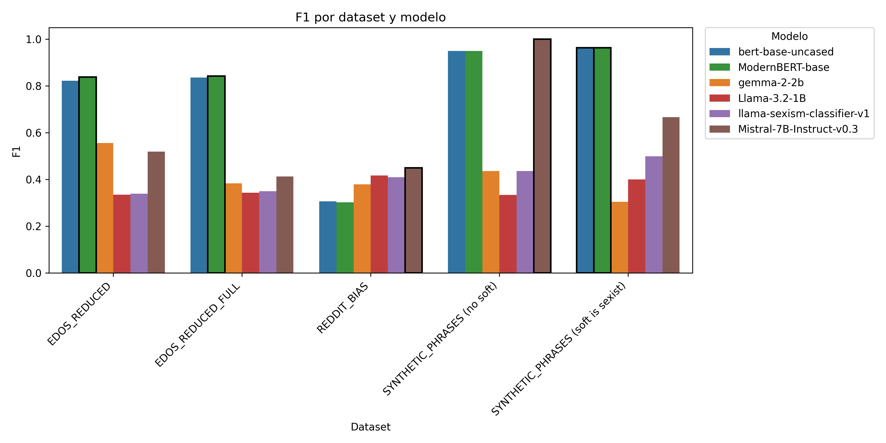
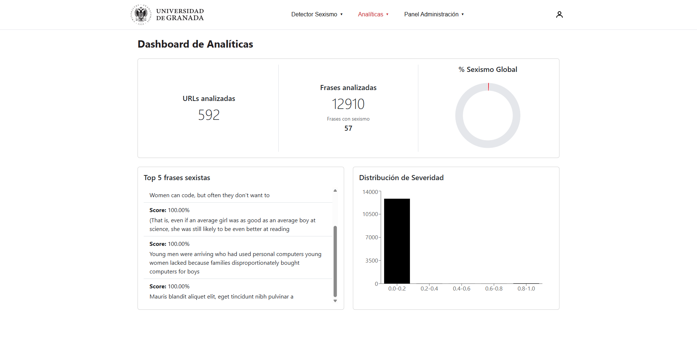
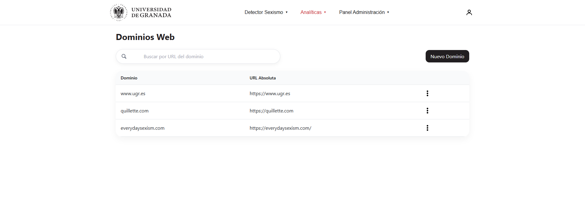
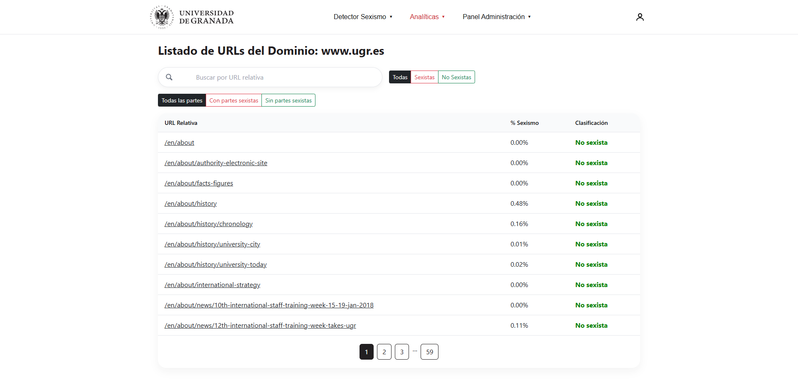
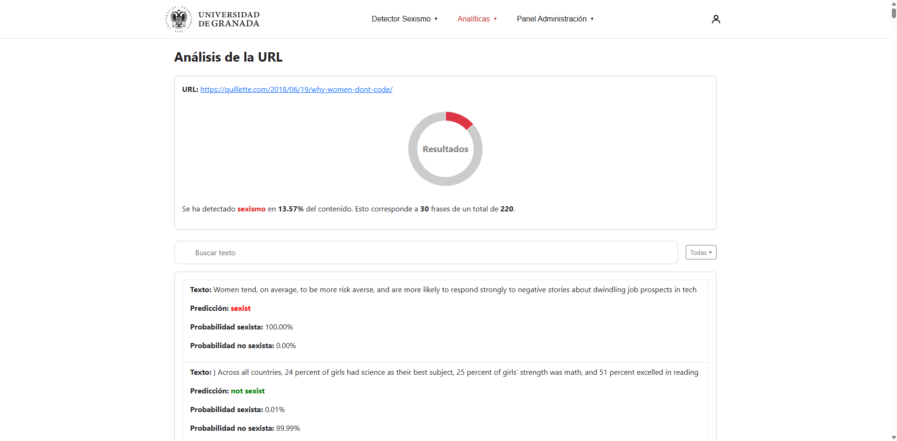

# LLMs para la detección automática de lenguaje sexista en redes sociales

Trabajo Fin de Máster — **Miguel Ángel Benítez Alguacil**
Máster Universitario en Ciencia de Datos e Ingeniería de Computadores, Universidad de Granada.

> 📄 La memoria completa (PDF) está disponible en la raíz del repositorio:
> [TFM - LLMs para detección automática de lenguaje sexista en redes sociales.pdf](<TFM - LLMs para detección automática de lenguaje sexista en redes sociales.pdf>)

Este repositorio contiene el código completo del proyecto: los experimentos de clasificación
(*fine-tuning* de modelos BERT/ModernBERT y *prompting* de LLMs generativos) y una aplicación
web (FastAPI + React) que despliega el mejor modelo como un servicio real de detección de
sexismo para textos, URLs y dominios completos.

## Índice

1. [Contexto y motivación](#contexto-y-motivación)
2. [Hipótesis y objetivos](#hipótesis-y-objetivos)
3. [Datasets](#datasets)
4. [Modelos comparados](#modelos-comparados)
5. [Metodología](#metodología)
6. [Resultados principales](#resultados-principales)
7. [Aplicación web](#aplicación-web)
8. [Conclusiones](#conclusiones)
9. [Trabajos futuros](#trabajos-futuros)
10. [Instalación y puesta en marcha](#instalación-y-puesta-en-marcha)
11. [Estructura del proyecto](#estructura-del-proyecto)
12. [Referencias principales](#referencias-principales)

## Contexto y motivación

El sexismo en redes sociales es una forma de discurso de odio especialmente persistente: se
manifiesta tanto de forma explícita (insultos, cosificación) como de forma sutil (estereotipos,
ironía, "explicaciones" condescendientes). La moderación manual de estos contenidos es
inviable a la escala de las plataformas actuales, y los clasificadores automáticos existentes
suelen tener dificultades para distinguir entre **discurso sexista** y **discurso que denuncia
el sexismo**, o para generalizar entre dominios (p. ej. de Twitter/Reddit a foros institucionales).

Al mismo tiempo, la aparición de **LLMs generativos** (Llama, Gemma, Mistral...) capaces de
clasificar mediante *prompting* sin entrenamiento adicional plantea la pregunta de si pueden
sustituir a los clasificadores *encoder-only* clásicos tipo BERT, y si arquitecturas más
recientes como **ModernBERT** aportan una ventaja real frente a `bert-base-uncased` en esta
tarea concreta.

## Hipótesis y objetivos

**Hipótesis:** un modelo tipo BERT, ajustado mediante *fine-tuning* con un preprocesado
cuidadoso y una búsqueda de hiperparámetros selectiva, puede ser competitivo —o incluso
superior— frente a LLMs generativos usados en modo *zero/few-shot*, manteniendo un buen
rendimiento incluso reduciendo a la mitad el conjunto de entrenamiento.

A partir de esta hipótesis se plantean tres objetivos principales:

- **O1.** Comparar dos arquitecturas *encoder* (`bert-base-uncased` frente a `ModernBERT-base`)
  mediante *fine-tuning* y una búsqueda de hiperparámetros (*grid search*) sobre el dataset
  EDOS, evaluando el impacto de reducir el conjunto de entrenamiento.
- **O2.** Comparar los mejores modelos *fine-tuned* frente a LLMs generativos (Llama, Gemma,
  Mistral) usados mediante *prompting* con *few-shot examples*, sobre tres esquemas de
  etiquetado (binario, 3 y 4 clases) y tres datasets de distinto dominio (EDOS, RedditBIAS y
  un conjunto de frases sintéticas).
- **O3.** Desplegar el modelo con mejor relación rendimiento/coste como un microservicio REST
  (FastAPI) con una interfaz web (React) que permita analizar texto, URLs o dominios completos,
  con persistencia de resultados, autenticación y control de acceso por roles.

## Datasets

| Dataset | Origen / dominio | Tamaño usado | Etiquetado |
|---|---|---|---|
| **EDOS** (SemEval-2023 Task 10) | Reddit/Gab, anotación triple | Subconjuntos balanceados de **5.000** y **10.000** ejemplos (sobre un total de 20.000), evaluación final también sobre el conjunto completo | Jerárquico: binario (`sexist`/`not sexist`), 3 clases (`not sexist`/`unsure`/`sexist`) y 4 clases (`not sexist`, `sexist (low confidence)`, `sexist (high confidence)`, `sexist`) |
| **RedditBIAS** | Reddit, subconjunto de género | ≈3.000 frases (≈2.060 `biased` / ≈940 `unbiased`) | Binario `biased`/`unbiased`, usado como banco de pruebas de **transferencia de dominio** |
| **Synthetic Phrases** | Creadas por el autor | 15 frases (5 *sexist*, 5 *soft sexist*, 5 *not sexist*) | 3 clases, también colapsadas a binario de dos formas distintas (ignorando o asimilando `soft sexist`) |

EDOS es el corpus principal de entrenamiento y *grid search*; RedditBIAS y Synthetic Phrases
se usan exclusivamente como **test de generalización** (ningún modelo se entrena con ellos).

## Modelos comparados

**Modelos *encoder* (fine-tuning supervisado):**

| Modelo | Parámetros | Contexto | Notas |
|---|---|---|---|
| `bert-base-uncased` | 110M | 512 tokens | *Baseline* clásico, ampliamente usado en clasificación de texto |
| `ModernBERT-base` | 149M | 8.192 tokens | RoPE, GeGLU, Flash Attention 2/3, 1,7T tokens de preentrenamiento, optimizador StableAdamW |

**LLMs generativos (clasificación por *prompting*, sin ajuste de pesos):**

- `Llama-3.2-1B`
- `google/gemma-2-2b`
- `MatteoWood/llama-sexism-classifier-v1` (Llama-2-7B ajustado con LoRA para esta tarea)
- `mistralai/Mistral-7B-Instruct-v0.3`

## Metodología

1. **Preprocesado**: limpieza de texto, generación de los distintos esquemas de etiquetas
   (binario / 3 / 4 clases) a partir de las anotaciones originales de cada dataset, y
   *undersampling* para balancear las clases al 50/50. Se mantiene el split original
   70/10/20 (train/dev/test) de EDOS.
2. **Fine-tuning + grid search**: para `bert-base-uncased` y `ModernBERT-base` se ejecuta una
   búsqueda de **54 combinaciones de hiperparámetros** (*learning rate*, *weight decay*,
   *batch size*) con *warm-up*, AdamW y *early stopping*, repitiéndose para cada esquema de
   etiquetado (binario, 3 y 4 clases) y cada tamaño de dataset (5k / 10k).
3. **Prompting de LLMs generativos**: clasificación *few-shot* (k=6 ejemplos para el esquema
   binario, k=12 para 4 clases), con *logits masking* para restringir la salida a los tokens
   de clase válidos, `temperature=None`, `do_sample=False`, `max_new_tokens=1` e inferencia por
   lotes (batch=8).
4. **Evaluación**: *accuracy*, *precision*, *recall* y **F1 macro** (recomendado en la
   literatura para datasets desbalanceados), matrices de confusión y *classification report*
   por clase.
5. **Análisis cualitativo**: revisión manual de casos de error (ironía, lenguaje vulgar,
   denuncias del propio sexismo) y de un caso de estudio "sesgo vs. sexismo" sobre RedditBIAS.
6. **Despliegue**: el modelo binario `ModernBERT-base` (entrenado sobre `reduced_10k`) se
   integra en un microservicio FastAPI + frontend React (ver [Aplicación web](#aplicación-web)).

## Resultados principales



*Figura: comparación de F1 (macro) por modelo y dataset en el esquema de clasificación binaria.
`ModernBERT-base` y `bert-base-uncased` dominan en EDOS y en las frases sintéticas; en
RedditBIAS (transferencia de dominio) los LLMs generativos llegan a superarlos.*

### Resumen ejecutivo

- **Mejor configuración global**: `ModernBERT-base` sobre EDOS-10k (binario) — **F1 = 0.843,
  recall = 0.853, accuracy = 0.843**, ligeramente por delante de `bert-base-uncased` (F1 = 0.836).
- **Los LLMs *few-shot* no cierran la brecha**: en el mejor caso (Mistral-7B sobre EDOS-10k
  binario) se queda en F1 = 0.413, **>40 puntos por debajo** de los modelos *fine-tuned*.
- **Transferencia de dominio limitada**: al evaluar en RedditBIAS (estereotipos sutiles, sin
  insultos explícitos) ningún modelo supera F1 = 0.45; los LLMs generativos (Mistral-7B,
  Llama-3.2-1B) superan por primera vez a los BERT *fine-tuned* en EDOS.
- **Frases sintéticas (casos claros)**: tanto `bert-base-uncased` como `ModernBERT-base`
  alcanzan **F1 ≈ 0.95–0.96**, confirmando que el sexismo explícito se detecta de forma fiable.
- **Coste de la granularidad**: pasar de 2 a 3 etiquetas reduce el F1 macro en EDOS de 0.84 a
  0.68 (–16 pp); pasar a 4 etiquetas lo reduce a ~0.52 (–16 pp adicionales). El esquema de 3
  clases ofrece la mejor relación detalle/rendimiento.
- **Eficiencia**: entrenar con la mitad de los datos (10k vs 20k) supone hasta un **87% de
  ahorro en GPU-horas**, perdiendo solo ~4 pp de F1 frente al mejor *baseline* oficial de
  SemEval-2023 (`DeBERTa-v3-base`, F1 = 0.8235).


### Validación sobre el dataset EDOS completo (20.000 ejemplos)

Los modelos entrenados con `reduced_10k` (la mitad del corpus) se evaluaron sobre el *split*
de test completo del dataset original, para medir el coste real de la reducción:

| Modelo | F1 | Accuracy | Precision | Recall |
|---|---|---|---|---|
| **bert-base-uncased** | **0.7876** | 0.8263 | 0.77 | 0.8254 |
| ModernBERT-base | 0.7774 | 0.813 | 0.7608 | 0.8261 |

Comparado con los resultados oficiales de SemEval-2023 Task A:

| Sistema | F1 |
|---|---|
| MostFrequent (baseline) | 0.4310 |
| Uniform (baseline) | 0.4509 |
| XGBoost (baseline) | 0.4933 |
| DistilBERT (baseline) | 0.7621 |
| **bert-base-uncased (este TFM, 10k)** | **0.7876** |
| DeBERTa-v3-base (mejor baseline) | 0.8235 |
| DeBERTa-v3-large + twHIN-BERT-large (1º clasificado) | 0.8746 |
| RoBERTa-large + ELECTRA (2º clasificado) | 0.8740 |
| DeBERTa (ensemble, 3º clasificado) | 0.8740 |

Es decir, con la mitad de los datos y una arquitectura BERT estándar nos quedamos a **~4 pp**
del mejor *baseline* del *challenge* y a **~9 pp** del sistema ganador, sin técnicas de
*ensemble*, *continued pre-training* ni arquitecturas de gran tamaño.

> Las tablas completas de los 54 experimentos de *grid search* por modelo/dataset están
> disponibles en el Apéndice A de la memoria y en `app/files/classification_results/` y
> `app/results/`.

## Aplicación web

El modelo binario `ModernBERT-base` (entrenado sobre `reduced_10k`) se ha integrado en una
aplicación full-stack que demuestra su uso en un escenario real:

- **Backend**: microservicio **FastAPI** (servido con `uvicorn`), con documentación
  interactiva autogenerada (`/docs`), pensado para desplegarse en contenedores (Docker/Podman)
  o entornos *serverless* (AWS Lambda, Google Cloud Run).
- **Frontend**: **React 18**, compilado y servido por el propio FastAPI (un único puerto,
  sin necesidad de Nginx/Apache adicional).
- **Persistencia**: SQLite3 embebida (suficiente para un piloto; se recomienda
  PostgreSQL/MySQL para producción con alta concurrencia).
- **Autenticación y roles**: JWT, con tres roles —`admin` (gestión total, usuarios y roles),
  `sexism_detection` (lanzar y ver análisis) y `analytics` (solo lectura de analíticas).


*Figura: pantalla de inicio de sesión de la aplicación.*

### Detector de Sexismo

Tres modos de análisis sobre el modelo binario:

- **Texto**: se pega un texto libre, se segmenta en frases y se devuelve un análisis global
  (% de frases sexistas) y un análisis por frase (etiqueta + probabilidad).
- **URL**: analiza el contenido textual de una URL concreta, con un filtro opcional por
  etiqueta HTML (p. ej. `article`) para restringir el *scraping*.
- **Dominio**: dado un dominio completo, el backend respeta `robots.txt`, localiza el/los
  `sitemap.xml`, extrae las URLs indexables y ejecuta la inferencia en paralelo,
  almacenando los resultados por URL.


*Figura: análisis de un texto libre, con el resultado global (% de frases sexistas) y el
desglose frase a frase con su predicción y probabilidades.*


*Figura: análisis del contenido textual de una URL, con el mismo resumen global y detalle por
frase, y un filtro opcional por etiqueta HTML.*


*Figura: análisis de un dominio completo a partir de su `sitemap.xml`, mostrando los sitemaps
localizados y las URLs detectadas para su posterior inferencia.*

**Prueba de concepto real**: se analizó el portal principal de la Universidad de Granada
(`www.ugr.es`, contenidos en inglés bajo `/en/`). Sobre **590 URLs** y **12.643 frases**, solo
**22 frases (≈0,002%)** se marcaron como sexistas, y la revisión manual confirmó que se trataba
de **falsos positivos** (frases que hablan *sobre* discriminación de género, no que la ejerzan).
Este resultado bajo era el esperado para una web institucional, y confirma que el modelo no
sobre-etiqueta contenido como sexista de forma indiscriminada.

### Analíticas

Módulo de consolidación de resultados con tres vistas:

- **Dashboard global**: nº de URLs y frases analizadas, % global de sexismo estimado, top-5
  frases más sexistas y un histograma de distribución de severidad (probabilidades).
- **Listado de dominios**: dominios analizados, con búsqueda y acceso al detalle de cada uno.
- **Listado de URLs por dominio**: paginado, con filtros por estado (sexista/no sexista) y
  acceso al detalle frase a frase de cada URL.



*Figura: dashboard global, con el número de URLs y frases analizadas, el % global de sexismo
estimado, el top-5 de frases más sexistas y un histograma de distribución de severidad.*



*Figura: listado de dominios web analizados, con búsqueda y acceso al detalle de cada uno.*



*Figura: listado paginado de URLs de un dominio, con su porcentaje de sexismo y clasificación
(sexista / no sexista).*



*Figura: detalle frase a frase del análisis de una URL concreta, con buscador y filtros por
clasificación.*

### Lecciones aprendidas (despliegue)

- FastAPI + React es una combinación ágil para un MVP con presupuesto y curva de aprendizaje
  reducidos.
- SQLite es suficiente para una prueba piloto, pero su falta de *row-level locking* limita la
  concurrencia en producción.
- Añadir *i18n* (backend y frontend) facilitaría la adopción en organizaciones
  internacionales.
- Un módulo de **entrenamiento continuo** con retroalimentación de moderadores permitiría
  refinar el clasificador con el tiempo.

## Conclusiones

- Un enfoque basado en BERT **sigue siendo competitivo** para la detección de sexismo,
  siempre que se combine con un preprocesado cuidadoso y una búsqueda de hiperparámetros
  selectiva: con solo 10k ejemplos balanceados, `ModernBERT-base` alcanza F1 = 0.84 y
  recall = 0.85, superando ligeramente a `bert-base-uncased` en el mismo escenario.
- Los **LLMs generativos con *few-shot prompting*** mejoran sobre modelos de tamaño similar,
  pero quedan **≥40 puntos por detrás en F1** si no se ajustan sus pesos.
- La **reducción del conjunto de entrenamiento** (20k → 10k) supone hasta un 50% de ahorro en
  GPU-horas con una pérdida de rendimiento de solo 4 pp frente al mejor *baseline* de
  SemEval-2023.
- La **API FastAPI + React** valida que el clasificador puede desplegarse con rendimiento
  suficiente para uso en tiempo real, incluso en hardware modesto.
- El análisis de errores revela limitaciones recurrentes: confusión entre **crítica al
  sexismo y sexismo real**, falta de robustez ante **ironía**, ausencia de **evaluación
  multilingüe** y fuerte dependencia de la **distribución de clases** del dominio de
  entrenamiento.

En conjunto, los resultados sitúan el proyecto en un punto intermedio: se dispone de un filtro
automático fiable para detección "gruesa" de sexismo explícito, pero aún lejos de una
herramienta que distinga con matices la intencionalidad, el contexto cultural y la sutileza
pragmática del discurso.

## Trabajos futuros

**1. Mejora del modelo y de la métrica**
- Modelar el *target* del discurso (mujer, colectivo LGTBI, autorreferencia...) para reducir
  falsos positivos en discurso antisexista.
- *Fine-tuning* con ejemplos críticos: frases antidiscursivas, ironía y contraargumentos.
- Métricas equitativas (p. ej. *macro AUROC* o *false-alarm penalty*) para datasets
  desbalanceados como RedditBIAS.

**2. Arquitectura y eficiencia**
- Explorar **QLoRA** para reducir el tamaño/VRAM de los modelos generativos (ejecutables en
  GPUs de 8GB o CPU).
- Evaluar modelos ligeros de última generación (*Phi-3-mini*, *MobiLlama*) para detección
  instantánea en dispositivos de bajo coste.

**3. Aplicaciones prácticas**
- Extensión de navegador que marque sexismo, discurso de odio o desinformación al vuelo.
- Filtro parental para redes y chats (p. ej. como servicio en Android).
- Soporte de **Speech-to-Text** y **OCR** para analizar audio, vídeo e imágenes/memes.

**4. Ampliación de datos y cobertura**
- Incorporar el dataset **BeyondGender-2025** y otros corpus en español, francés o chino para
  un clasificador verdaderamente multilingüe.
- Ampliar el banco de ejemplos *few-shot* con anotación enriquecida (tono, objetivo,
  confianza).

## Instalación y puesta en marcha

### Backend (FastAPI)

```bash
# 1. Crear y activar un entorno virtual
python -m venv venv
venv\Scripts\activate          # Windows
source venv/bin/activate       # Linux / macOS

# 2. Instalar dependencias
pip install -r requirements.txt

# 3. (Opcional) Configurar pre-commit (black, flake8, etc.)
pre-commit install

# 4. Arrancar el servidor de desarrollo
uvicorn app.main:app --reload
```

El servidor arranca en modo *reload*, recargando automáticamente ante cambios en el código.

Crea un archivo `.env` en la raíz del proyecto con las siguientes variables:

```env
PROJECT_NAME=...
VERSION=...
OPEN_AI_KEY=...
REDDIT_CLIENT_ID=...
REDDIT_CLIENT_SECRET=...
DATABASE_URL=...
HUGGINGFACE_TOKEN=...
ACCESS_TOKEN_EXPIRE_MINUTES=...
ALGORITHM_JWT=...
SECRET_KEY_JWT=...
```

### Frontend (React)

```bash
cd frontend
npm install

npm start      # servidor de desarrollo en http://localhost:3000
npm run build  # build de producción, servido directamente por FastAPI
```

### Documentación de la API

Con el servidor en marcha, la documentación interactiva (Swagger UI) está disponible en:

- http://127.0.0.1:8000/docs

Los endpoints bajo la etiqueta **"Sexism Detection"** permiten generar los datasets,
lanzar el *grid search* de *fine-tuning*, ejecutar la inferencia de los LLMs generativos y
evaluar los modelos sobre EDOS, RedditBIAS y Synthetic Phrases — es decir, reproducir los
experimentos descritos en este documento.

## Estructura del proyecto

```
app/                    Backend FastAPI
├── routers/            Endpoints REST (auth, sexism_detection, web_crawling, results...)
├── utils/               Lógica de preprocesado, entrenamiento, evaluación e inferencia
├── enums/               Enumerados de datasets y modelos (DatasetEnum, ModelsEnum...)
├── database/            Capas de persistencia (SQLAlchemy + SQLite async)
├── files/                Datasets y resultados intermedios (CSV)
├── results/              Métricas, matrices de confusión y tablas LaTeX de la memoria
├── models/               Checkpoints de los modelos entrenados
└── external_projects/    Copia vendorizada de RedditBias (subsistema legado)

frontend/               Aplicación React (analizador de sexismo + analíticas + administración)
```

El backend combina dos capas de persistencia: una base **SQLAlchemy/SQLite** para el dominio
de *web crawling* y analíticas (`Domain`, `URL`, `URLSexistContent`), y un wrapper **async
SQLite** independiente para autenticación (`users`, `roles`). La resolución de modelos y
datasets de ML sigue las convenciones de `DatasetEnum`/`ModelsEnum` (`app/enums/`), que mapean
cada dataset/modelo a sus rutas de datos y checkpoints bajo `app/files/` y `app/models/`.


## Referencias principales

- Hannah Rose Kirk et al. *SemEval-2023 Task 10: Explainable Detection of Online Sexism*. 2023.
- Soumya Barikeri et al. *RedditBias: A Real-World Resource for Bias Evaluation and Debiasing of
  Conversational Language Models*. 2021.
- Jacob Devlin et al. *BERT: Pre-training of Deep Bidirectional Transformers for Language
  Understanding*. 2019.
- Benjamin Warner et al. *Smarter, Better, Faster, Longer: A Modern Bidirectional Encoder for
  Fast, Memory Efficient, and Long Context Finetuning and Inference* (ModernBERT). 2024.
- Xuan Luo et al. *BeyondGender: a multifaceted bilingual dataset for practical sexism
  detection*. 2025.

La bibliografía completa (28 referencias) está disponible en la memoria del TFM.
